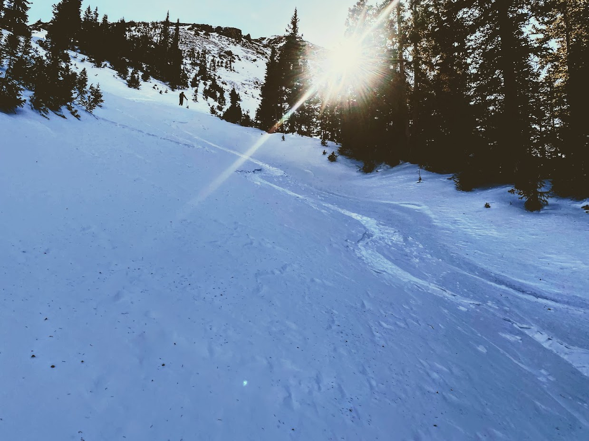
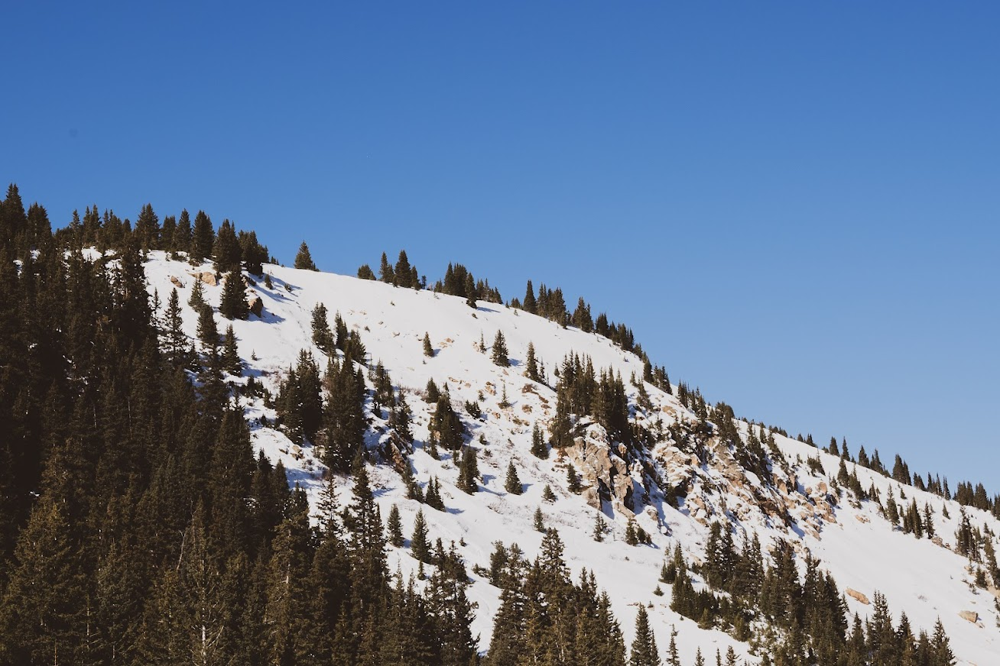
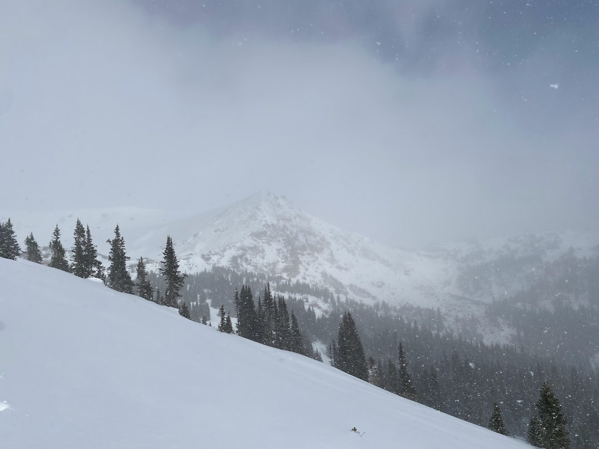
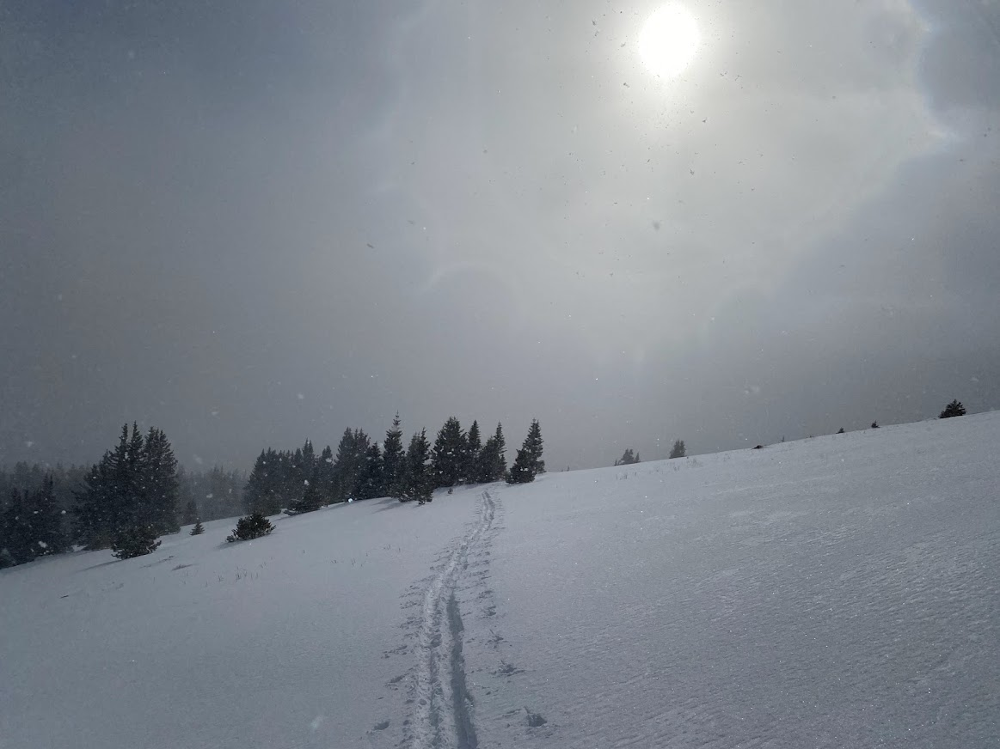
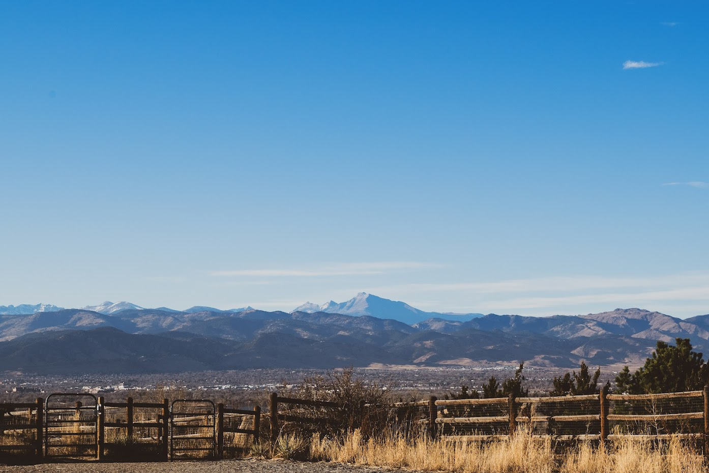
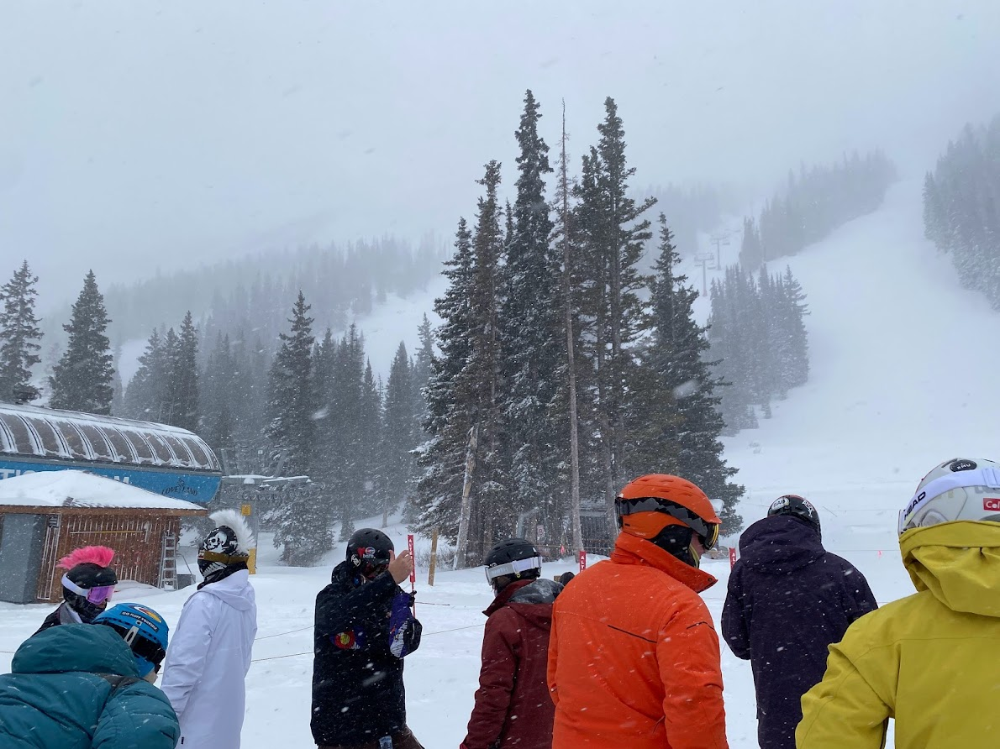
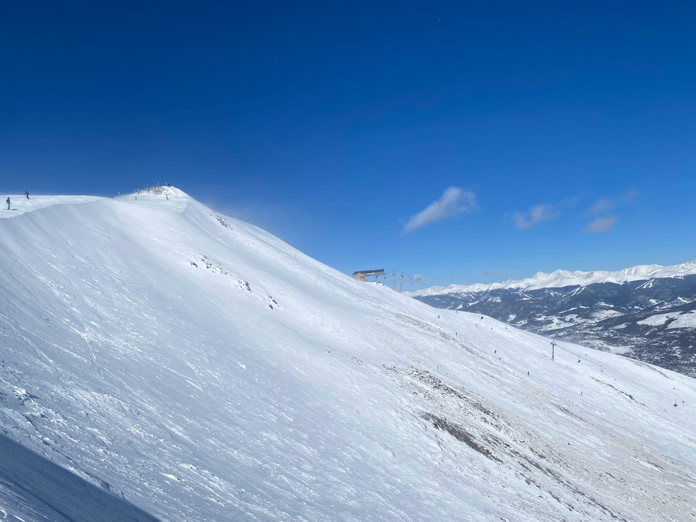
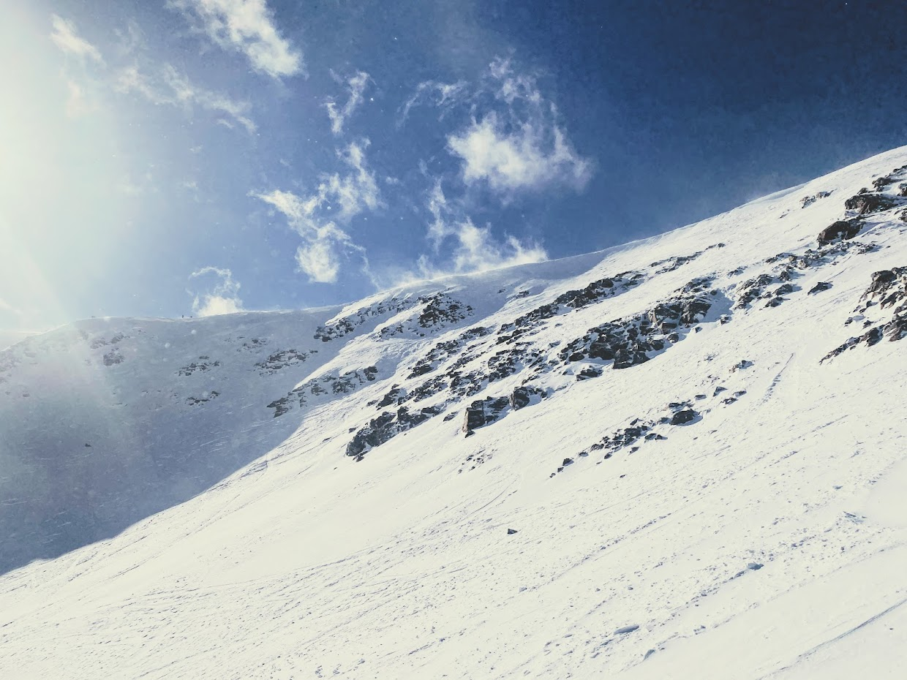

The end of 2021 was a wild one.

On Christmas Eve, the engine of my car siezed on the way back from Arapahoe Basin leaving me stranded on the side of the road for much of the evening. Turns out the dealership had made a mistake during the oil change. Luckily they admitted fault and are in the process of fixing any damage by replacing many parts of the engine.

Sierra and I were evacuated from our apartment in Louisville during the fires. That first night we were sure that our apartment had burned down. The next day we were able to get updates that it had indeed stood and suffered no fire damage, but we had to remain in a hotel for a few days while heat and potable water were restored.

On the other hand, Colorado finally got some major snow storms. I got to ski multiple fresh snow days at Arapahoe Basin, and ended up skiing a pow day at Loveland Ski Area. Traffic on I-70 was crazy with all of the snow and ice, but it didn't get in the way of lots of good days on the slopes.

## Butler Gulch, 7 Nov

Got some early season touring in at Butler Gulch. Coverage wasn't terrible for how early it was. Though, I did hit a pretty bad shark and took a fall. Not a big deal though, just a stiff neck the following day.

## Berthoud Pass, 23 Nov

Berthoud Pass has reliably good coverage in the winter months, and is easily accesible. Which makes it an appealing option, especially early season. Though, this also means that it gets tracked out very quickly. So, this day consisted of skiing moguls in the backcountry; better than icy groomers.

## Berthoud Pass - No Name Bench, 24 Nov

Some nice light snow, made for a suprisingly good day of fresh tracks jsut down the road from the main area at Berthoud Pass.

## Davidson Mesa Dog Park, 2 Dec

I love going to this dog park with our dog. Unfortunately it is very close to where a lot of the damage occured in the recent fires.

## Loveland Ski Area, 6 Jan

After a solid two weeks of storms, we got a nice 12" inches over night. Unfortunately this meant that I-70 was a nightmare. I left around 5am from our hotel that we were staying in due to evacuation, but still didn't feel as though I'd make it to A Basin in time to get first tracks. So, I decided to get a day ticket to Loveland. Not knowing the mountain well, I just hit Chet's Dream chair all day. I got a few really nice pow laps.

## Breckenridge Skiing, 22 Jan

Sierra and I spent a weekend in Brekcenridge. We skied at Breckenridge on Saturday but it was way too crowded so ended up just hitting A Basin on Sunday. The skiing at Breckenridge is really awesome though. I'm a particularly big fan of the terrain arround 6-chair. It gets loads of sun, so often has softer more fun snow than elsewhere on the mountain. Plus it gives you access to the imperial chair, where you can hike to the Lake Chutes which has some really amazing terrain.

