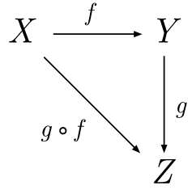
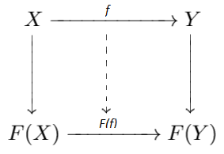

### The Generic Type Array is the functor, not instances of arrays

It may seem unecassary to write yet another article on functors in functional programming when there are so many already written.
However, I believe that most of these articles miss or obscure the insight gained from stealing the notion of functor from pure math.
Hopefully, I can add to that small subset of articles that clarify the picture and increase the probabilty that newcomers stumble accross helpful posts.

The key point of this article will be that **Array is a functor**.
This is because Array is a mapping between categories that obeys certain rules.
That is, Array takes an element of one category and gives you a new element in a different category, and it does this in a particularly nice way.
**Notice that I did not say arrays are functors.**
I am refering to here the "Generic" type that takes a type **T** and returns a new type **T[]**.
Array maps between the **Category of Types** and itself.

A standard function takes an element from one set (or type) and returns an element from a different set (or type). For example:

```typescript
function f(x: number): string {
  return x.toString();
}
// This function takes an element from the set (or type) 'number' and returns an
// element from the set (or type) 'string'
```

A functor does something a bit more meta. It takes a set (or type) and returns a new set (or type.) For example, if you givce the type **number** to array, it will give you back the type **number[].**
And most significantly, it does this in a manner that perserves functions between types.
For example, if you have a function with signature **func(x: number): string**, and you pass this to the **Array** functor, you will get back a function with signature **func(x: number[]): string[]**
This is the main thrust of the article.
If you have experience with the subject hopefully this is enough to gain the correct understanding.
If not, we will dive in further in the following paragraphs.

First, we will navigate around the definition of categories.
This is clearly important for the technical study and understanding of functors, but not really for our purposes so will give a quick sense of what they are.
Wikipedia has the technical definition if you are interested.
The thing to understand is that categories are incredibly abstract, to the point where even mathematicians call Category Theory "Abstract Nonsense."
The basic idea is that a category is just a collection of objects such that between each pair of objects there is a collection of functions (or "morphisms") that go between them.
This may sound vague, but that is the point.
Almost anything you can think up is going to be a Category in at least some twisted sense.
There just has to be objects and things that go between those objects that obey the rules for categories.



In the example of a "diagram" above, $$X$$, $$Y$$, and $$Z$$ represent objects of some category and $$f$$, $$g$$ and $$g \circ f$$ represent functions that go between those objects.
Sybomilized in this diagram is the notion of function composition, which you are likely familiar with if you have been doing some functional programming.
The fact that morphisms must be composable is one of the necessary elements of a category.

The most natural Category is the Category of Sets, which has as its objects Sets and as its functions just simple set-functions.
(Sets in mathematics are similar but conceptually slightly different from sets in you may have seen in Programming).
Set-functions are exactly those type of functions that you dealt with in mathematics growing up.
For example, the square function is a function from the real numbers back to the real numbers, because it maps a real number x to another real number $$x^{2}$$.

The Category we will be talking about the most is the Category of Types. The objects of this Category are the types of your preffered programming language, and the functions are just any pure function. For example, number and string are two objects in the Category of Types for JavaScript. A morphism between them is the **x.toString()** method. Of course, we could also have a morphism between number and itself. The square function would be an example of this. It takes a number and returns a number.

Now, taking this idea slightly further, we may even envision a Category of Categories (there are some important but nongermane philisophical issues with this, I encourage you to read about Russel's Paradox).
Here, the objects would be Categories but what would the "functions" be?
This is where functors come in.
They are "functions" between Categories.
They take an object in one Category and give you an object in another Category.
Equally importantly, if you have a function between two objects in your first category, you also get a function between the objects in your new category.



In the diagram above, $$X$$ and $$Y$$ represent objects in one category with $$f$$ a morphism between them. All three of these get mapped to coresponding objects and morphisms in another category under the functor $$F$$.

Now, lets examine why Array is a functor. Array takes a type from your Category of types and returns you a new type in the Category of types and it does so in a manner that respects functions.

```typescript
//This represents a function between two types T -> K
type simpleFunction<T, K> = (arg: T) => K;

// This is an explicit function of the type just defined
// where T = number and K = string
const f: simpleFunction<number, string> = (x) => `number ${x.toString()}`;

// This is the function map that takes a function f: T -> K
// and returns a function mapF(f): T[] -> K[]
function map<T, K>(f: simpleFunction<T, K>): simpleFunction<T[], K[]> {
  return (arr) => arr.map(f);
}

// An explicit example of mapping a function and then using it
let m = map(f);
console.log(m([1, 2, 3]));
```

Here is a repl.it with some of the code from above that you can play around with.

<iframe frameborder="0" width="100%" height="500px" src="https://repl.it/@AndrewDoumont/FunctorExample?lite=true"></iframe>
