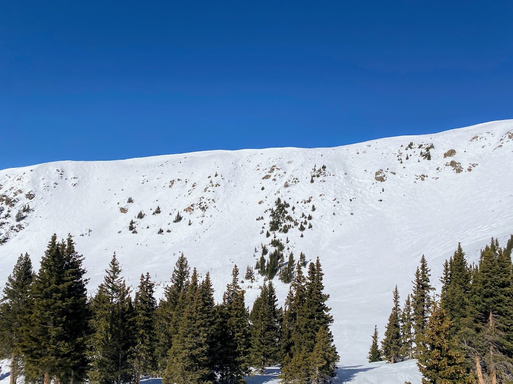

In the CU-Boulder math PhD program we call qualifying exams "Preliminary Exams" for some reason. Anyway, I passed both of mine marking a pretty big step in the graduate program.

## Arapahoe Basin, 19-20 Feb

Sierra and I got some great skiing in at A Basin over President's Day Weekend

## Georgetown Trip

Sierra and I stayed in Georgetown to have a little get-away and be a bit closer to skiing. It was a great trip and it was awesome to seeing Sierra crushing some skiing again after she has been recovering from surgery.

## Camping near Brainard Lake, 25-26 March

Sierra and I did a small camping trip near Brainard Lake. The road is still closed at the winter closure area, so we skied in about two miles to around the lake to set up camp and spend the night. It was a great opportunity to see what considerations we should make in the future camping in snow. It was really an amazing trip and it was awesome to spend so much time with Sierra!

## Berthoud Pass, 31 March

Went up to Berthoud pass with the plan to just do a training day but the snow turned out to be excellent as well. End up getting 5300' of vertical in with almsot all the turns in fresh snow

## Willie's Wide, 2 Apr

Incredibly stoked to watch Sierra boot up and slay her way down Willie's Wide on the East Wall of A Basin. Even better is we got to do it twice. Even better, the line had about 5 inches of soft wind-buff snow on top. Really fun skiing.

## Arapahoe Lakes Trees and Rayback, 3 Apr

On Sunday, Levi and I got out with a tentative plan to ski Frosty Mountain in the James Peak Wilderness. Southern aspects had been looking good in terms of having a stability, minus wind slabs and wet slabs. It was forecasted to be overcast and cold that day though, so we figured wet slabs wouldn't factor in. Wind slabs could still have presented a concern though. However, we decided not ski Frosty mainly based on wind conditions since we didn't want to be above treeline in such windy conditions. So, we got 4 laps in the trees below Arapahoe Lakes.

After skiing, Sierra and I got a few beers at Rayback in Boulder.

## Berthoud Pass, 9 Apr

Sierra and I did some skiing around Berthoud Pass. It was mostly a sunny day of chill skiing. The snowpack was stable enough to allow us to ski some steeper stuff though. We skied "Lift Gully" which is some steeper terrain you can see right from the main parking lot on the pass.

## Berthoud Pass, Random Days

## Quandary Peak, 28 Apr

Skied Quandary Peak's East Face on a great day.
