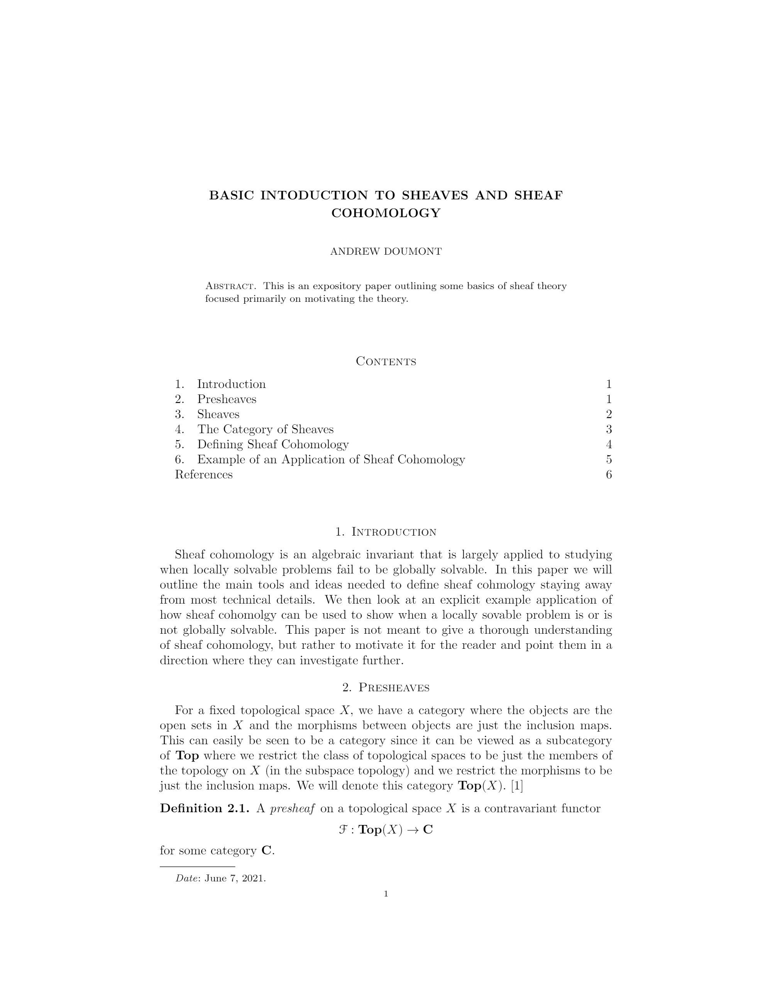
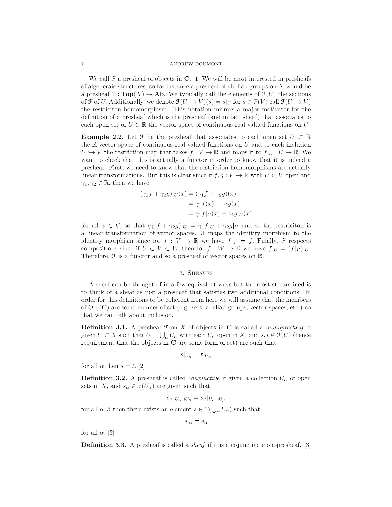
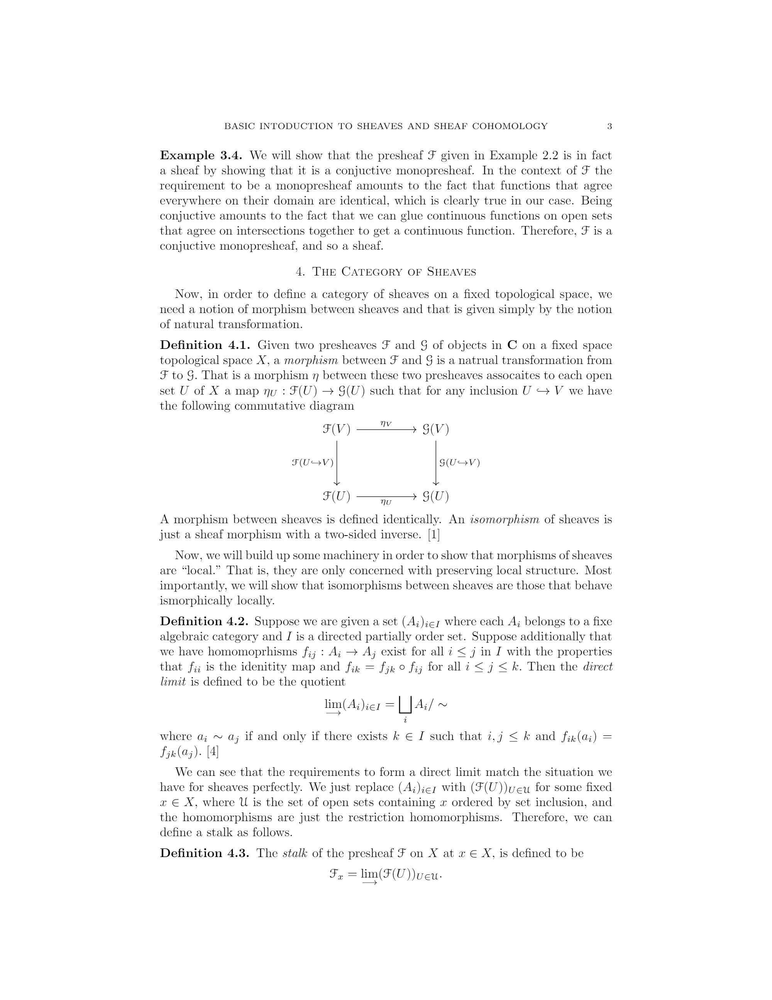
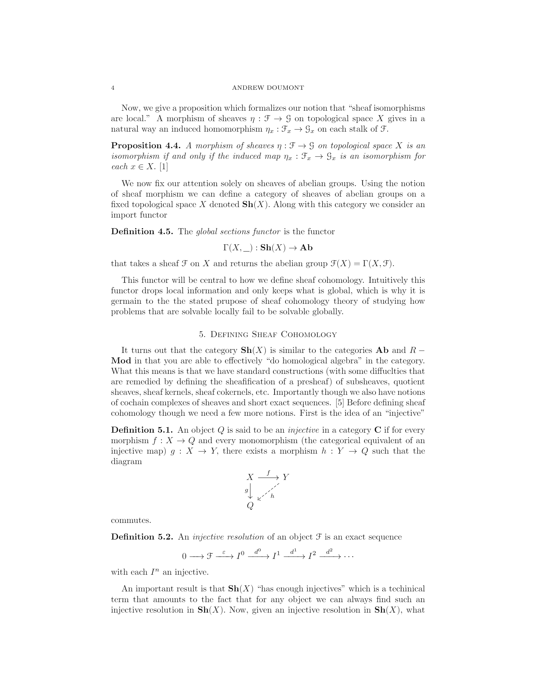
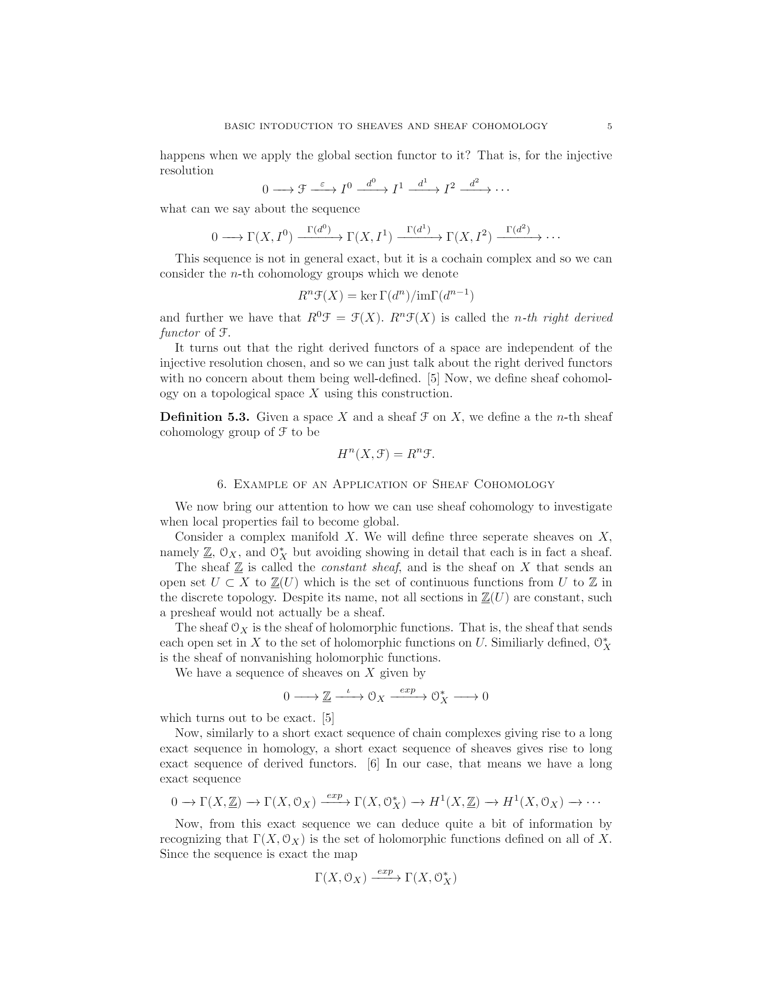
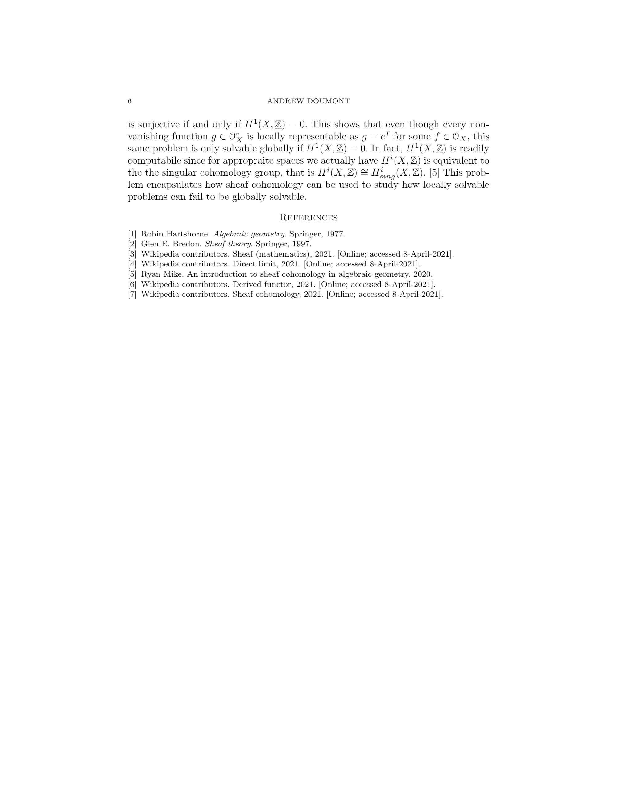

Below is a paper I wrote for a topology course I took in Spring 2021. It outlines the very basics about Sheaf Cohomology. The pdf can be found

<!-- <a href="https://ad-site.netlify.app/static/Sheaf_Cohomology_Intro.pdf">here.</a> -->

## Basic Introduction to Sheaves and Sheaf Cohomology

